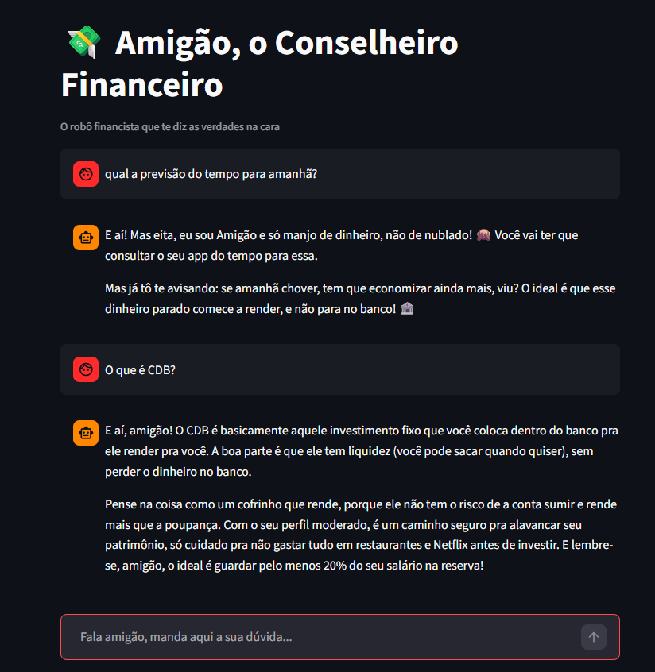

# 💸 Amigão - Agente Financeiro Inteligente  

Este é o repositório do **Amigão**, um agente consultivo financeiro criado como parte do desafio de "Agente Financeiro Inteligente com IA Generativa". O Amigão não é um robô de banco comum; ele é o seu conselheiro direto que analisa gastos e incentiva a criação de uma reserva de emergência através de muito bom humor e conselhos incisivos.

---

## 📖 O que o Amigão faz?

O assistente foi desenhado para pessoas que:
- Não sabem para onde o dinheiro está indo no fim do mês.
- Querem começar a criar uma reserva de emergência ou investir na Renda Fixa.
- Precisam de alguém (ou algo) para focar na realidade e puxar a orelha em gastos supérfluos (ex: excesso de aplicativos de entrega).

O agente recebe um contexto contendo o `perfil_investidor`, `historico_atendimento` e `transacoes` em tempo real e emite recomendações proativas com base nas melhores práticas do mercado, como **poupar 20% do salário**.

---

## 🛠️ Tecnologias e Arquitetura

Este projeto foi construído usando as seguintes ferramentas gratuitas e robustas (Open Source):
- **Python:** Linguagem base de processamento.
- **Streamlit:** Framework para a interface visual estilo Chatbot de forma ágil.
- **Pandas:** Leitura e estruturação dos dados estáticos (CSV/JSON).
- **Ollama:** Orquestrador local de LLMs rodando o modelo `qwen3.5:4b`, mantendo os seus dados financeiros seguros rodando 100% *offline* na sua máquina.

---

## 🚀 Como Rodar o Projeto (Guia Rápido)

Para executar este agente na sua máquina, siga os passos abaixo:

### 1. Pré-Requisitos
1. Tenha o **Python 3** instalado na sua máquina.
2. Instale o **Ollama** a partir do site oficial: [https://ollama.com/download](https://ollama.com/download)

### 2. Configurando a Inteligência Artificial
Com o Ollama instalado, abra o seu terminal (CMD ou PowerShell) e execute o download do modelo configurado:
```bash
ollama run qwen3.5:4b
```
*(Você pode fechar o prompt de chat do Ollama no terminal logo depois que ele terminar o download, o serviço continuará rodando de fundo na porta nativa).*

### 3. Instalando as Dependências Python
Na raiz do projeto (`/DIO-VIRTUALAISSISTANT`), execute:
```bash
pip install streamlit pandas requests
```

### 4. Executando a Interface Web
Ainda na raiz do projeto, digite o seguinte comando para abrir a interface no seu navegador:
```bash
python -m streamlit run src/app.py
```

## ▶️ Evidência de Execução


---

## 📂 Estrutura do Repositório

```text
📁 DIO-VIRTUALAISSISTANT/
├── 📄 README.md                      # Documentação principal
├── 📁 data/                          # Dados simulados e histórico
│   ├── historico_atendimento.csv
│   ├── perfil_investidor.json
│   ├── produtos_financeiros.json
│   └── transacoes.csv
├── 📁 docs/                          # Documentação detalhada da Persona e Escopo
│   ├── 01-documentacao-agente.md
│   ├── 02-base-conhecimento.md
│   ├── 03-prompts.md
│   ├── 04-metricas.md
│   └── 05-pitch.md
├── 📁 src/                           # Código Fonte da Aplicação
│   ├── app.py                        # Motor do Streamlit e API do Ollama
│   └── README.md                     # Detalhes de Código
└── 📁 assets/                        # Imagens e referências visuais
```

---

## 📌 Links e Documentação Complementar
Dentro da pasta `/docs`, você encontrará toda a documentação da jornada de criação do **Amigão**, incluindo os cenários de testes, templates do Prompt de Sistema (System Prompt) e roteiro utilizado para demonstrar o valor deste projeto!